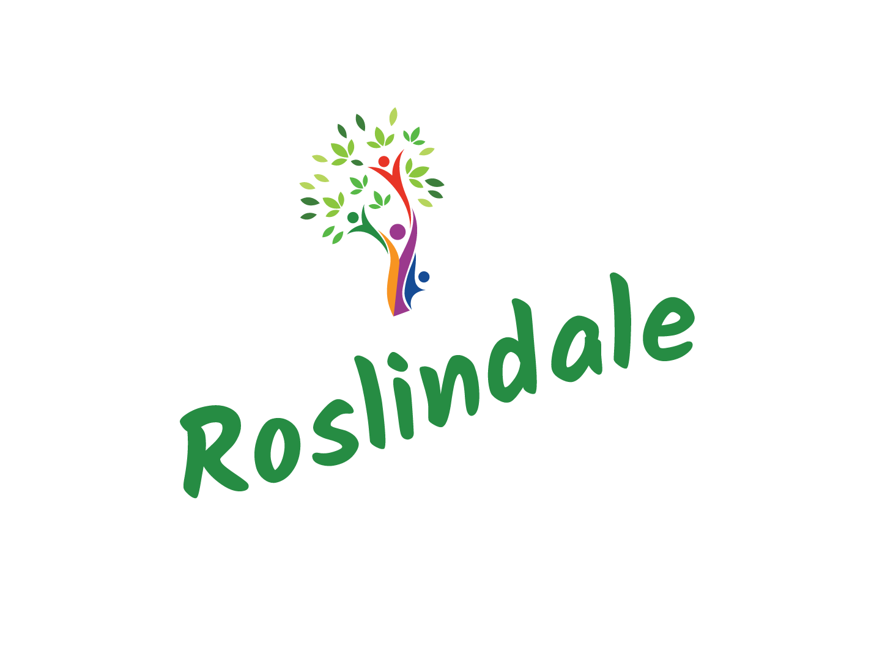
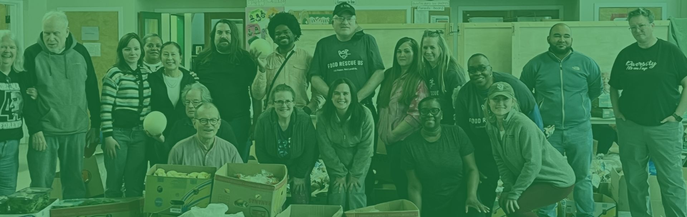

# 🥬 Roslindale Food Collective - Intake Tracker

<div align="center">
  
  <br/>
  
</div>

## Overview
The **RFC Intake Tracker** is a Progressive Web App (PWA) designed specifically for the fast-paced environment of the Roslindale Food Collective's intake operations. 

It provides volunteers with a highly optimized, mobile-first interface to rapidly log food weights and categories without relying on native device keyboards. Crucially, the app is **offline-first**. It caches all entries locally on the device, ensuring that intake operations are never interrupted by spotty Wi-Fi or cellular dead zones in the facility. Once a session is complete, the data is synced in bulk directly to a central Google Sheet.

## 📱 How to use for volunteers

Volunteers do not need to download anything from an App Store.

1. Open the live GitHub Pages URL in Safari (iOS) or Chrome (Android).
2. Tap the **Share** icon (iOS) or the **Menu** icon (Android).
3. Select **"Add to Home Screen"**.
4. The Intake Tracker will now appear as an app icon on the device and can be launched offline.

## ✨ Features
* **Custom Numpad UI:** Oversized touch targets for rapid weight entry.
* **Strict State Machine:** Auto-advances from weight entry to category selection to minimize screen taps.
* **Time-Delayed Undo:** A built-in 3-second grace period after every entry to instantly pop and edit the last recorded item.
* **Offline Storage:** Utilizes `localStorage` to securely hold hundreds of entries locally until the user actively decides to sync.
* **Zero-Friction Sync:** A single button press transmits the offline batch to a Google Apps Script webhook, appending the data to the master Google Sheet.
* **Installable (PWA):** Can be added to any iOS or Android home screen to function exactly like a native app.

## 🛠️ Architecture & Tech Stack
* **Frontend:** Vanilla HTML5, CSS3 (CSS Grid), JavaScript.
* **Local Data:** Web Storage API (`localStorage`).
* **Hosting:** GitHub Pages (Static, free, auto-HTTPS).
* **Backend Database:** Google Sheets via Google Apps Script (GAS).

## 🚀 Setup & Deployment Guide

### 1. Google Sheets Backend Setup
1. Create a new Google Sheet for intake data.
2. Navigate to **Extensions > Apps Script**.
3. Paste the following webhook code:
```javascript
   function doPost(e) {
     const sheet = SpreadsheetApp.getActiveSpreadsheet().getActiveSheet();
     const data = JSON.parse(e.postData.contents); 
     const rows = data.map(item => [item.timestamp, item.weight, item.category]);
     
     sheet.getRange(sheet.getLastRow() + 1, 1, rows.length, rows[0].length).setValues(rows);
     
     return ContentService.createTextOutput(JSON.stringify({"status": "success"}))
       .setMimeType(ContentService.MimeType.JSON);
   }

```

4. Click **Deploy > New Deployment**.
5. Select type **Web app**.
6. Execute as: *Me*. Who has access: *Anyone*.
7. Copy the generated Web App URL and paste it into the fetch request in `app.js`.

### 2. Frontend Hosting

1. Commit all files (including the `Media` folder) to the `main` branch of this repository.
2. In the GitHub repository, navigate to **Settings > Pages**.
3. Under **Build and deployment**, set the source to deploy from the `main` branch.
4. Save, and your app will be live at `https://[your-username].github.io/[repo-name]/`.

## 📁 File Structure

```text
/
├── index.html        # Main application layout and PWA structure
├── style.css         # CSS Grid layout and mobile-first styling
├── app.js            # Offline logic, undo timer, and sync webhook
├── manifest.json     # PWA configuration (icons, theme colors, standalone mode)
└── Media/            # Branding assets
    ├── logo-new.svg
    ├── logo-transparent.png
    ├── logo-transparent.svg
    └── page-title.jpg

```
